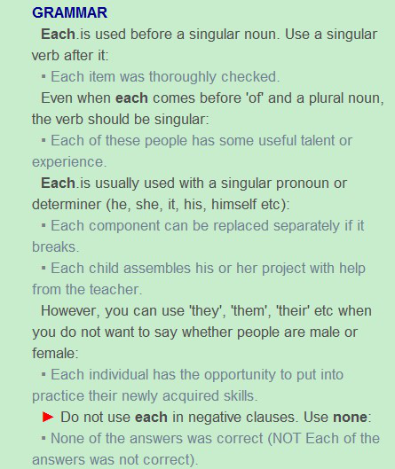
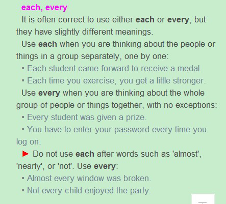

Hello!I am trying a new strategy to learn English grammar.In highschool we usually learn grammar by grammar books.We look through the rules ,which is very boring ,then do excises.What we learn is how to choose the right options and fill the blanks correctly.However,we still find it difficult to write articles or analyze them.To my opinion now, the best way to learn proper English grammar is to analyse articles and practice writing.In order to make it more interesting,I choose the literary masterpiece *Greek Myths*.I will analyze most of the sentences in the story below.

## 
 Pandora’s Box 
 ##

When the gods created the earth, they made it a perfect place for man. Each of the gods gave man a gift, such as strength, intelligence, and skills, and they filled the earth with everything that man needed to live happily. Fruit trees grew everywhere, and beautiful flowers gave out a delicious drink called nectar that gave people energy. No people needed to work or hunt, and people never grew old or sick or died.

The only thing that the gods did not give man was fire. This they kept for themselves. They feared that giving man fire would make him as powerful as the gods and would cause him to destroy the many wonderful things that the gods had put on earth.

One day, the Titan named Prometheus stole some fire from heaven and gave it to man. Though man knew that fire was the possession of the gods, they still accepted Prometheus’ gift. Zeus was very angry at this and decided to punish man. He called on Hephaestus, the god of metal and fire, and asked him to build a woman out of stone Aphrodite, the goddess of love, modeled for the statue so that it would be beautiful. When it was finished, Athena breathed life into the cold stone and it came alive. Then each of the gods gave the woman a gift. Aphrodite taught her how to dance and how to attract any man without even having lo look at him.

## 
Grammar Analysis
  ##

#### 1.When the gods created the earth, they made it a perfect place for man.

时间状语从句when引导，过去时，make为不完全及物动词中的使役动词，表示使……成为，it指代the earth，for man为副词修饰place，for这里表示目的（同do it for you）.

#### 2.Each of the gods gave man a gift, such as strength, intelligence, and skills, and they filled the earth with everything that man needed to live happily.

并列连词and链接两句话，过去时，第一句each of 词组有许多需要注意的地方，以下是Longman Dictionary给出的Grammar。

- Each只用在单数前面，后面接动词的单数形式。
- 即使Each后面加个of变成Each of后面需要接复数名词，动词还是应该用单数。
- Each总是后面接单数代词或限定词。
- 但是当你不想强调人是男是女可以用复数代词them之类的。
- 在否定从句中不要用Each，要用None。

另外朗文词典中也给出了Each和Every的区别。

- 强调个人用Each。
- 强调整体用Every。
- 在类似于almost，nearly，not这种词之后用Every，不用Each。

Such as+名词，注意这里面的名词可以为可数，也可以为不可数，Strength和Intelligence不可数，Skills可数，即使gift可数。这个句型也适合学习，可以用来进行列举，取代For example或For instance。Fill属于表提供的授予动词，除了offer，其余与with连用。Everything做它后面定语从句need的宾语，that可用which代替，need做不完全及物动词用need somebody to do something，happily修饰live。

#### 3.Fruit trees grew everywhere, and beautiful flowers gave out a delicious drink called nectar that gave people energy.

并列连词and链接两句话，过去时，give out是个词组，called nectar是由which is called nectar化简而来，为过去分词做后置定语，因为是被动关系所以用called不用calling。

#### 4.No people needed to work or hunt, and people never grew old or sick or died.

并列连词and链接两句话，过去时，need为一般动词，之后可以接不定式短语做宾语，never要放在动词前面，died这里当形容词用。

#### 5.The only thing that the gods did not give man was fire.

定语从句，give为授予动词，man为间接宾语，the only thing为直接宾语，若间接宾语与直接宾语位置颠倒时，需要另外加介词，give加to。

#### 6.This they kept for themselves.

强调宾语把This放到了前面，for和keep无关。

#### 7.They feared that giving man fire would make him as powerful as the gods and would cause him to destroy the many wonderful things that the gods had put on earth.

一般句，过去时，Giving man fire为动名词短语做主语，可以改为it would make man as powerful as the gods to give him fire，注意的是man对应him。Would这里是指过去将来时，will的过去式，不指虚拟语气。Would make him powerful +as……as句型，第一个as表示一样地，第二个as为副词连词。Cause这里是不完全及物动词，用法为cause somebody/something to do something接不定式做宾语。On earth为地点副词短语。

#### 8.One day, the Titan named Prometheus stole some fire from heaven and gave it to man. 

句子长时时间副词one day可以放在句首，此时加个逗号。

#### 9.Though man knew that fire was the possession of the gods, they still accepted Prometheus’ gift. 

Though做副词连词引导状语从句，注意用be the possession of 时物做主语，still放在动词之前。

#### 10.He called on Hephaestus, the god of metal and fire, and asked him to build a woman out of stone. Aphrodite, the goddess of love, modeled for the statue so that it would be beautiful. 

并列连词and链接两句话，过去时，the god of metal and fire和the goddess of love为同位语，call on为短语动词。Ask为不完全及物动词，属于使役动词，这类动词必须以不定式短语做宾语补语。Out of这里是介词短语表示由……制作成。So that是副词连词，表示以便，so that引导的状语从句中应该有助动词may will can 等。

#### 11.When it was finished, Athena breathed life into the cold stone and it came alive. 

breathe life into something为固定用法。

#### 12.Aphrodite taught her how to dance and how to attract any man without even having to look at him.

How to dance为疑问词+不定式=名词短语，without介词短语修饰her，后面接动名词短语

## 
The End
 ##