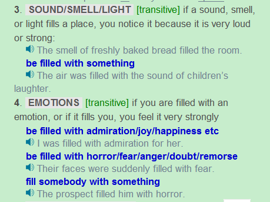

## 
 Orpheus and Eurydice(continue the story from the previous post)
 ##

You must walk up the stairs out of Hades and not turn back to look at her or this world. Not until you have arrived back in the world of the liv-ing can you turn around. If you wish to see your wife, just look into my tear that you now hold in your hand and you will see her, like in a mirror, behind you.”

Orpheus began the long walk up the stairs, all the while holding the god’s single tear up in front of him to see his wife behind him. In the tear he saw Eurydice following behind him as best she could. Her foot still hurt from the snake bite, and she walked slowly and silently. The stairs were dark and high, and Eurydice often slipped because of her hurt foot. Each time she slipped, Orpheus wished to run to her, but knew he could not. They walked an hour, and a terrible thought appeared in Orpheus’ head. “What if Hades has tricked me into leaving the Land of the dead, and Eurydice is not really behind me?” This thought became bigger and bigger inside of Orpheus’ head, until he could not think of anything else. He called out to Eurydice, begging her to answer him, but heard no reply. 

## 
Grammar Analysis
  ##

#### 1.Not until you have arrived back in the world of the living can you turn around. 

Not until是固定用法，为否定倒装句，所以后面用can you。Turn around为固定用法。

#### 2.Orpheus began the long walk up the stairs, all the while holding the god’s single tear up in front of him to see his wife behind him. 

All the while为副词词组，表示一直，hold something out/up etc也为固定词组。

#### 3.In the tear he saw Eurydice following behind him as best she could.

这里的as best she could 是特殊用法，查阅google为:

#### 4.Her foot still hurt from the snake bite, and she walked slowly and silently.

Hurt的过去式和过去分词都是hurt。

#### 5. The stairs were dark and high, and Eurydice often slipped because of her hurt foot. 

Because of这里为介词表示原因，Longman Dictionary给出了用法:

写作中常用due to，owing to和as a result of因为更正式一些 

#### 6.Each time she slipped, Orpheus wished to run to her, but knew he could not. 

But knew he could not 为But he knew he could not do it的化简。 所以两句主语相同时能化简，do it与前面重复也可化简。

#### 7.They walked an hour, and a terrible thought appeared in Orpheus’ head. 

想到……东西，用 appear in……head即物作主语，而不是人作主语。

#### 8.“What if Hades has tricked me into leaving the Land of the dead, and Eurydice is not really behind me?”

Longman Dictionary给出的What if用法:

trick somebody into doing something为固定用法。

#### 9.This thought became bigger and bigger inside of Orpheus’ head, until he could not think of anything else. 

Instead of 为美国用法，正常情况下用inside就行，不用加 of，until为副词连词。

#### 10.He called out to Eurydice, begging her to answer him, but heard no reply. 

Call out为动词短语，Longman Dictionary给出了它的用法，

## 
The End
 ##