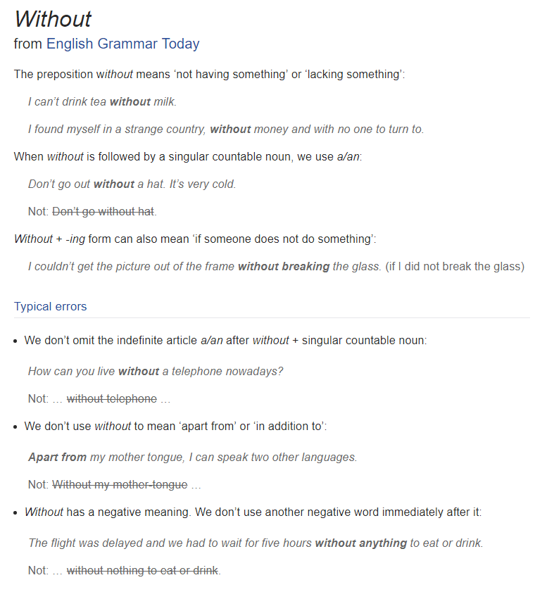
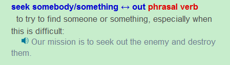

## 
 Orpheus and Eurydice(the last part)
 ##

In truth, Eurydice was calling to him loudly, but the dead made no sound to the living. Finally Orpheus could not bear it any longer and took a quick look behind him. The moment he did this, many servants of Hades flew down and grasped Eurydice. As they pulled her back into Hades, Orpheus ran up to her and grasped her hand. They touched each other one last time before she was pulled away.

Eurydice looked at her husband with deep love and did not blame him for his impatience for how could she be angry at his desire to see her? “Goodbye, my love,” she said, “a fi¬nal goodbye.” She then disappeared into the darkness.
Suddenly Orpheus found himself back in the light of the world. The entrance to the cave was covered with large rocks that he could not move. He begged the gods to let him back into Hades to try one more time, but he received no answer. He sat at the cave entrance for three days and nights, without food or water. He then played his lyre and sang a song so sad that everything that heard it felt that their heart would break. The wild animals could not bear to hear a song so sad and begged him to stop. Orpheus refused, and the animals, crazy with sadness, attacked him and pulled him into hundreds of tiny pieces.

His spirit, free from his body, fell happily into Hades where he sought out his Eurydice and held her in his arms. They still walk together happily in Hades, his playing the lyre and her singing, and Orpheus may look at her as much as he wishes, without fear of her disappearing from his arms.

## 
Grammar Analysis
  ##

#### 1.Finally Orpheus could not bear it any longer and took a quick look behind him.  

Not …… any longer为固定用法，表示不再……。等于no longer，no more，not anymore。

#### 2.The moment he did this, many servants of Hades flew down and grasped Eurydice.  

The moment=as soon as，见Longman Dictionary，

#### 3.They touched each other one last time before she was pulled away.

Each other 整体作为代词，句中若有after，until，before等连词引导的从句，由于时间先后很清楚，可用一般过去时代替过去完成时。

#### 4.Eurydice looked at her husband with deep love and did not blame him for his impatience for how could she be angry at his desire to see her? 

第二个for为副词连词，表示原因，后面接正常的句子，be angry at为固定短语，和be angry with是一样的。

#### 5.Suddenly Orpheus found himself back in the light of the world.  

这里的back为形容词，因为此时find为不完全及物动词，加了宾语之后用名词或形容词做宾语补语。

#### 6.The entrance to the cave was covered with large rocks that he could not move. 

Be covered with为固定词组。

#### 7.He sat at the cave entrance for three days and nights, without food or water.  

三天三夜可以表示为for three days and nights，without food or water为副词短语，用法见下图

#### 8.He then played his lyre and sang a song so sad that everything that heard it felt that their heart would break. 

这句话看起来有语法错误，其实是sang a song which is so sad that化简而来。

#### 9.Orpheus refused, and the animals, crazy with sadness, attacked him and pulled him into hundreds of tiny pieces. 

Crazy with sadness应该为which is crazy with sadness化简而来。

#### 10.His spirit, free from his body, fell happily into Hades where he sought out his Eurydice and held her in his arms.

注意这种插入语句型的使用，seek out为固定词组，并且注意seek过去式为sought，

#### 11.They still walk together happily in Hades, his playing the lyre and her singing, and Orpheus may look at her as much as he wishes, without fear of her disappearing from his arms.

His playing为that he is playing化简而来。注意as much as的使用，这句话后面的, without fear of her disappearing from his arms中her disappearing也是由that she is disappearing化简而来，因为that引导的名词从句不能做介词宾语。Disappear后面接from。

## 
The End
 ##