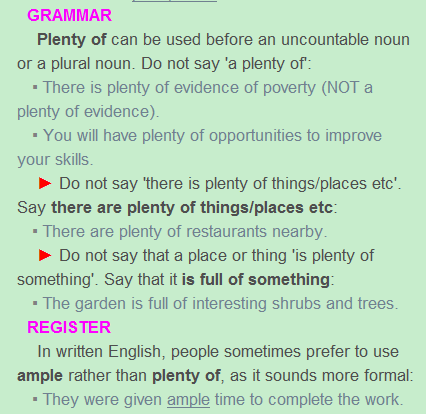

## 
 Pandora’s Box (continue the story from the previous post)
 ##

Athena gave her great wisdom. Apollo taught her how to play many musical instruments, and the Muse’s taught her how to sing. Hermes taught her how to speak wonderful lies that made other people happy. The last gift was given to her by Hera, Zeus’ wife, and this was curiosity. The gods then named her Pandora, which means, “All-gifted” and placed her down on earth with all the common men.

Zeus went down to earth with Pandora and gave her one last gift. It was a beautiful box, closed with a heavy lock. He then gave Pandora the key to the box and told her that she must never open it, or let anybody else open it for any reason.

After a short time, one of Prometheus’ brothers, Epimetheus, met Pandora and fell deeply in love with her. She loved him as well and returned with him to his small village. They lived there together happily because life was easy and there were no troubles. The people of the village spent their days dancing and singing in the warm sunshine. Plenty of food grew on the trees and clean water ran through the rivers. Also, since nobody ever grew old or became ill, there was no way to die or lose a friend, family member, or a lover. Everyone’s life on earth was perfect.

Though Pandora was happy living with Epimetheus, she could not forget the box that Zeus had given her. This was because Hera had given her the gift of curiosity, and each day Pandora’s curiosity grew bigger and bigger inside her.

## 
Grammar Analysis
  ##

#### 1.Athena gave her great wisdom.

Wisdom修饰常用great。

#### 2.The gods then named her Pandora, which means, “All-gifted” and placed her down on earth with all the common men.

因为先行词为专有名词Pandora，定语从句应该为which引导的非限制性定语从句，故前面应该加逗号。Down后面没有宾语为介副词，on earth和with all the commen men都为副词短语。注意这里要用men。

#### 3.Zeus went down to earth with Pandora and gave her one last gift.

One last为固定词组，表示最后一个。

#### 4.It was a beautiful box, closed with a heavy lock.

这里应该没有逗号，因为非限制性定语从句不能化简(which is closed)，而且box是一般名词，不是专有名词或者独一性名词。With a heavy lock仍然是副词短语，修饰closed。

#### 5.He then gave Pandora the key to the box and told her that she must never open it, or let anybody else open it for any reason.

To与key连用形成固定用法，为副词短语，to表示针对(the key to success)。Let为不完全及物动词，后面接原型不定式。For any reason为副词短语，for表原因。

#### 6.After a short time, one of Prometheus’ brothers, Epimetheus, met Pandora and fell deeply in love with her.

After a short time 为副词短语，放句首要加逗号。one of Prometheus’ brothers和Epimetheus是同位语。

#### 7.The people of the village spent their days dancing and singing in the warm sunshine.

注意为The people of the village不是in，spend time etc doing something固定用法。

#### 8.Plenty of food grew on the trees and clean water ran through the rivers.

注意plenty of的用法，Longman Dictionary给出语法为:

- 用在不可数名词或者复数名词前面，不要说成a plenty of
- 要说there are plenty of 不要说 there is plenty of
- 不要说一个地方或者一个东西is plenty of something 要说 is full of something
- 在英语写作中常用ample 而不用plenty 因为ample更正式一些。

#### 9.Everyone’s life on earth was perfect.

On earth 副词短语放在了be动词之前。

#### 10.Though Pandora was happy living with Epimetheus, she could not forget the box that Zeus had given her. 

其实应该是这样的Pandora was happy，Pandora lives with Epimetheus。变为Living with Epimetheus，Pandora was happy。
因为前面多了一个Though，所以变成Though Pandora was happy living with Epimetheus。

#### 11.This was because Hera had given her the gift of curiosity, and each day Pandora’s curiosity grew bigger and bigger inside her.

注意each day 放在了最前面，inside此处为介词，inside +sb为固定短语表示in your body。

## 
The End
 ##