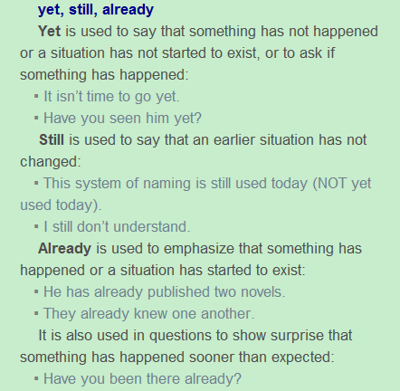
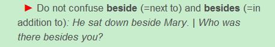

## 
 Pandora’s Box (continue the story from the previous post)
 ##

Then she took the key out of her pocket and carefully inserted it into the lock. As she turned the key, the box became even brighter and more beautiful. When she opened the top, she was amazed because the box was filled with the most beautiful jewels that she had ever seen! These were her gift from Zeus! But why wasn’t she supposed to open it? With those jewels, she and Epimetheus could live like a King and Queen!

She awoke from her dream and sat up in bed. It was still dark, and Epimetheus was asleep at her side. She jumped out of bed and ran out to her garden. Her hands quickly pushed away the rocks that sat over the hole. She moved the heavy rocks so quickly that her hands began to bleed, but she didn’t notice because there was not yet pain or suffering in the world. She dug into the earth and didn’t stop until she felt the top of the box. Grasping the box with excitement, she pulled it out of the hole and placed it on the earth beside her. Almost without realizing it, she put her hand into her pocket and pulled out the key.

For a short moment, Pandora looked at the key laying in her hand. The metal was cold, and Pandora had never felt cold before. Unable to stop what she had begun, Pandora put the key into the lock. The feeling of cold ran through her body quickly, but she ignored it. She opened the lock and threw the top of the box open.

## 
Grammar Analysis
  ##

#### 1.Then she took the key out of her pocket and carefully inserted it into the lock.

Then也可以放在句首,carefully放在动词前面。用it代替key避免重复。

#### 2.As she turned the key, the box became even brighter and more beautiful.

Become这里是当系动词，后面可接形容词表语。

#### 3.With those jewels, she and Epimetheus could live like a King and Queen!

此句可看做是纯条件虚拟语气，with those jewels 表示条件，主句应该加上助动词can。

#### 4.It was still dark, and Epimetheus was asleep at her side.

at sb’s side为固定词组，asleep为adj，做be动词表语。

#### 5.Her hands quickly pushed away the rocks that sat over the hole.

本来应该是push somebody/something away 但是 rock后面有定语从句，所以把away提前。这里sat用的很形象，over这里表示覆盖在……之上，有接触物体的状态。

#### 6.She moved the heavy rocks so quickly that her hands began to bleed, but she didn’t notice because there was not yet 

Yet的用法可以参考Longman Dictionary的解释

- Yet说明一些还没发生，情况还没出现的事情，或者去询问某件事情是否发生。
- Still说明一些已经发生了的事情情况仍然没有改变。
- Already用于强调某个事情已经发生了或者某个情况已经存在。
- 也用于当一件事发生的比预期的还快时的惊讶。

#### 7.Grasping the box with excitement, she pulled it out of the hole and placed it on the earth beside her.

此句为she grasped the box with excitement 的化简，beside为介词，注意beside和besides的区别，以下是Longman Dictionary给出的解释。

一个表示next to，另一个表示in addition to。

#### 8.Almost without realizing it, she put her hand into her pocket and pulled out the key.

Almost without realizing it为副词短语,realizing可以看成动名词，后面接宾语it，pull out the key 也可以 pull the key out，这里的out为介副词。

#### 9.For a short moment, Pandora looked at the key laying in her hand. 

For这里表示持续一段时间(比如for a long time)，laying为 which lies简化过来，所以这里应该为lying不是laying。

#### 10.The metal was cold, and Pandora had never felt cold before.

Before做副词用放句尾，表示距过去某时若干时间以前，时态用过去完成时。

#### 11.Unable to stop what she had begun, Pandora put the key into the lock.

Unable to stop what she had begun为独立不定式，使用时通常置于句首。Put为不完全及物动词，into the lock为宾补。

#### 12.She opened the lock and threw the top of the box open.

Throw这里为特殊用法，为不完全及物动词。

## 
The End
 ##