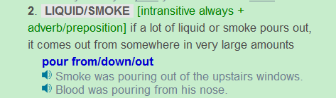
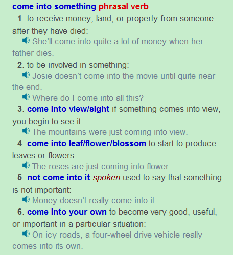
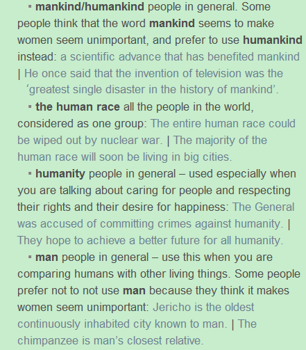

## 
 Pandora’s Box (continue the story from the previous post)
 ##

Suddenly a thick, black smoke poured out of the box and came into her eyes. She felt something that she had never felt before: it was pain. She could not see clearly and began to cry. When her vision returned, she looked down to see thousands of tiny monsters escaping from the box. They were running and fly¬ing out of the box in all directions, spreading out into the world. She grabbed one of the monsters in her hand, and it bit one of her fingers. She immediately became ill from the bile, and her body fell down onto the box causing its lop to close. She lay on the ground with the box in her arms breathing heavily and feeling the sickness that the monster had given her filled her body.
After a minute, she heard a small voice cry out, “Please open the lid of the box.”
Pandora listened to the voice and worried that it was just another little monster trying to trick her. “Why should I let you out,” she cried, “ I’ve already caused so much damage!”
“Please let me out of the box,” said the voice. “I’m not like the others, I can help to fix what you have done; I can reduce the pain and suffering of mankind.” With her last bit of strength, Pandora opened the top then fell back down onto the earth. A small, golden light then appeared before her. When Pandora looked at it, she saw that it was a small woman with a pair of wings. The tiny woman came down to Pandora’s face and kissed her lightly on the nose.

## 
Grammar Analysis
  ##

#### 1.Suddenly a thick, black smoke poured out of the box and came into her eyes.

Suddenly后面没有加逗号,thick和black两个形容词并列时用逗号,pour的用法参照Longman Dictionary，

Out of可以当做介词，也可当作动词后面单独跟的副词。Came后面的into应该为介词，因为come into短语没有文章这个意思。

#### 2.When her vision returned, she looked down to see thousands of tiny monsters escaping from the box. 

Look当看讲时，为不及物动词，down为副词，to see thousands of tiny monsters为不定式当副词用(类似于I come to see her)，后面为who is escaping 化简而来。

#### 3.They were running and flying out of the box in all directions, spreading out into the world.

spreading out into the world为分词结构的单句化简法。即由They were spreading out into the world化简而来。

#### 4.She immediately became ill from the bite, and her body fell down onto the box causing its top to close.

这里的causing 不是由which is causing 化简而来，而是另外一种情况，是两个动词所代表的动作同时发生时，第二个动词一定要变成现在分词。所以后一句应该是her body caused its top to close。

#### 5.She lay on the ground with the box in her arms breathing heavily and feeling the sickness that the monster had given her filled her body.

这里的breathing指的也是两个动词所代表的动作同时发生时，第二个动词一定要变成现在分词，Sickness is filled her body=her body fills with sickness。故最后面是由which is filled化简而来。

#### 6.After a minute, she heard a small voice cry out, “Please open the lid of the box.”

Hear后面接原型不定式，做宾语补语

#### 7.“Why should I let you out,” she cried, “ I’ve already caused so much damage!”. 

一定为let you out，因为代词必须放中间。

#### 8.“I’m not like the others, I can help to fix what you have done; I can reduce the pain and suffering of mankind.”

Like此处为介词，like the others为介词短语。Mankind与其他几个词的区别

- mankind指普通人，防止对女人不公平用humankind
- the human race指把所有人看做一个群体
- humanity指普通人，多用于权利和幸福方面。
- Man也指普通人，多用于和其他生物比较时。

#### 9.With her last bit of strength, Pandora opened the top then fell back down onto the earth. 

这个with不是用作虚拟语气的with，不是表条件，而是介词短语做副词放在句首，因为这不是虚拟的事实，而是真实的事情。

#### 10.A small, golden light then appeared before her.
 

Before可以当介词用。

#### 11.The tiny woman came down to Pandora’s face and kissed her lightly on the nose. 

注意为on the nose。

## 
The End
 ##