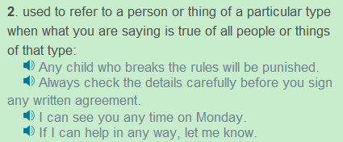
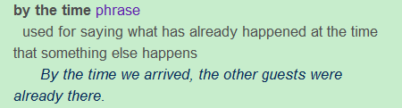
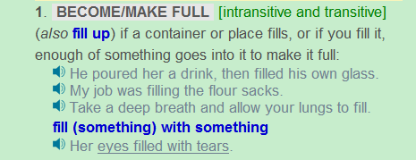
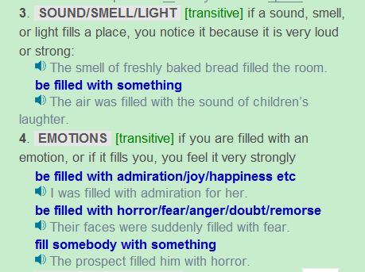

## 
 Orpheus and Eurydice
 ##

Orpheus was not just any ordinary man. He was the son of the god Apollo and the Muse of music, Calliope. His father gave him a magical lyre when he was just a young boy and taught him to play sweet music upon it. By the time he was a young man, he played his instrument so perfectly that the heart of every man, woman, and ehild filled with warmth when they heard him. Even the animals and plants listened to him. When the wild animals heard his music, they gathered around him in a circle; when the tree listened, their leaves grew faster; the flowers turned their heads toward the sound; even the hard rock became softer when Orpheus played. The gods themselves loved Orpheus’ playing and sent a beautiful woman called Eurydice to him to be his wife. Orpheus loved Eurydice more than anything in the world, more than riches, more than music, more than himself. But Orpheus and Eurydice’s marriage was not a lucky one. Not long after their marriage, Eurydice was wandering in the fields, singing, and dancing, when she was seen by a lonely man called Aris- taeus. Aristaeus was amazed with Eurydice’s beauty and was determined to have her. He followed her through the fields with the hope of catching her. When Eurydice saw him, she was filled with fear and ran away as fast as she could. Because she was not watching where she was going, she stepped on a snake in the grass. The snake hit her, and she died.

## 
Grammar Analysis
  ##

#### 1.Orpheus was not just any ordinary man. 

Just这里代表only，any这里为特殊用法，Longman Dictionary对此有解释，

#### 2.By the time he was a young man, he played his instrument so perfectly that the heart of every man, woman, and child filled with warmth when they heard him.

By the time为副词连词，用法见Longman Dictionary，

这里又出现了so……that句型，fill (something) with something为固定用法。

#### 3.When the wild animals heard his music, they gathered around him in a circle; .

Around也为介词。

#### 4.Orpheus loved Eurydice more than anything in the world, more than riches, more than music, more than himself. 

注意这种写法，后面可以进行列举，为依次递进的关系。

#### 5.Not long after their marriage, Eurydice was wandering in the fields, singing, and dancing, when she was seen by a lonely man called Aristaeus. 

注意singing和dancing插入句子中的用法。

#### 6.Aristaeus was amazed with Eurydice’s beauty and was determined to have her. 

Be amazed at和be amazed with 两种说法都存在，但是at更多一些。Be determined to do为固定用法。

#### 7.When Eurydice saw him, she was filled with fear and ran away as fast as she could.  

Fill的用法有很多，有时用主动，有时用被动，下面看Longman Dictionary给出的例子:

- ……充满用主动，用fill with
- 声音，气味，光线充满一个地方用be filled with，或者直接用主动fill，没有with
- 表示某种情绪充满某个人时，用人做主语用be filled with，或者用物做主语fill不用被动

#### 8.Because she was not watching where she was going, she stepped on a snake in the grass. 

这里的where可以视为疑问代词，引导名词性从句，此时可做及物动词的宾语，类似于I know where he is。Step为[intransitive always + adverb/preposition]是不及物动词，后面加副词短语，比如这句中的on a snake。

#### 9.The snake hit her, and she died.

Hit的过去式为hit过去分词也为hit，现在分词为hitting。

## 
The End
 ##