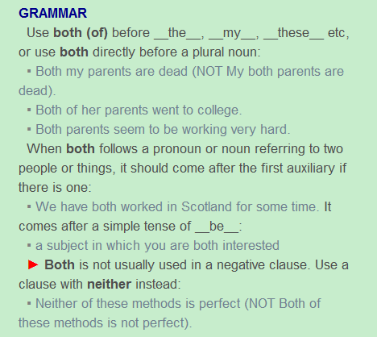

## 
 Orpheus and Eurydice(continue the story from the previous post)
 ##

“Great gods of the under-world,

 to whom all men must one day come,

 please hear my words,

for they are true and from my deepest heart.

I have not come to spy on your secrets,

or to test my strength against the monsters of this world.

1 have come to find my wife,

who was taken from me too early by the bite of a snake.

I have come here for love.

Love, the most powerful of the gods of the men who live on the earth, and, I believe, a powerful god here as well.

I beg you, great gods who have the greatest power, please return my wife to me and let her live again.

All men will come to you in time,

and Orpheus and Eurydice will both return to serve you.

But let her live again,

just for the time of a common life on earth, so that she can stand by my side.

If you will not do this,

I cannot return alone;

I will stay here in the under-world.”

As he sang these words and played his lyre, all the ghosts of Hades cried great tears. Then for the first time, it is said, the king of Hades himself let a single tear fall from his eye. Orpheus moved quickly and caught the tear and held it in his hand. The god then said, “ You have moved my heart, Orpheus, and I will give you what you ask. You may take your wife out of Hades on one condition:

## 
Grammar Analysis
  ##

#### 1.I have not come to spy on your secrets, or to test my strength against the monsters of this world. 

spy on为固定用法。

#### 2.All men will come to you in time, and Orpheus and Eurydice will both return to serve you. 

In time为固定用法。Both的用法见Longman Dictionary:

Both放在第一个助动词后，故这里放在will后面。

#### 3.If you will not do this,I cannot return alone;

此句为纯条件虚拟语气，if从句的动词用现在时，主句则是现在时助动词加上动词原型，这里为will。

#### 4.As he sang these words and played his lyre, all the ghosts of Hades cried great tears.

Cry也可以做及物动词，cry great tears.

#### 5.Then for the first time, it is said, the king of Hades himself let a single tear fall from his eye. 

It is said为现在时，single代表一个的意思，相当于one。

#### 6.The god then said, “ You have moved my heart, Orpheus, and I will give you what you ask. 

注意此句的时态。

#### 7.You may take your wife out of Hades on one condition.

On one condition表示在一个条件下，表示虚拟语气，故加may。Out of Hades做take的宾语补语。

## 
The End
 ##