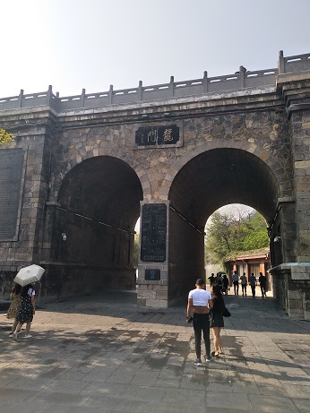
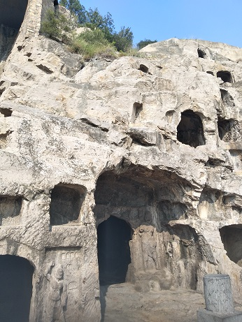
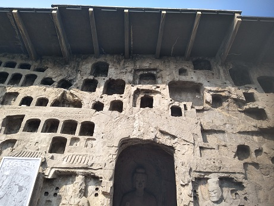
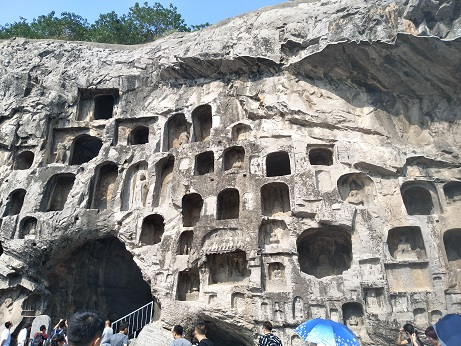
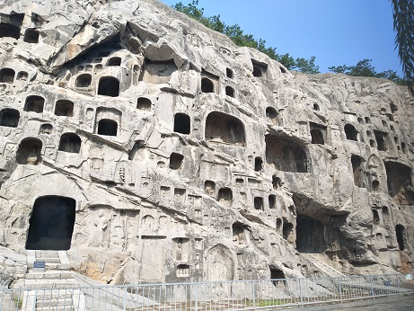
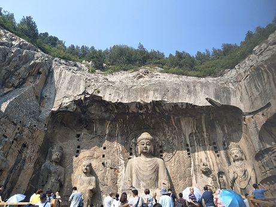
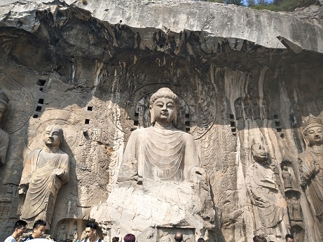
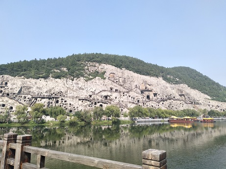
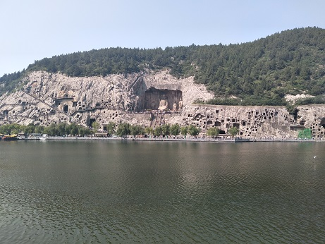

## 
 Longmen Grottes 
 ##

### 
 We are now at the front door. 
 ###

### 
 Not far from the entrance appears some awesome grottoes. 
 ###

### 
 They just like many windows. 
 ###

### 
 Also some. 
 ###

### 
 Also some. 
 ###

### 
 After seeing many delicate caves，you can see the big Vairocana of Longmen Buddha Grottoes here. 
 ###

### 
 closer. 
 ###

### 
 We cross the river to another side of the lake, and I take photos on a bridge. 
 ###

### 
 Panorama of the Buddhist sculptures in the main Longmen Grotto. 
 ###

## 
The End
 ##