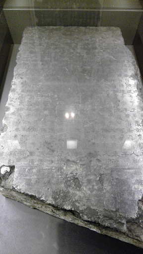
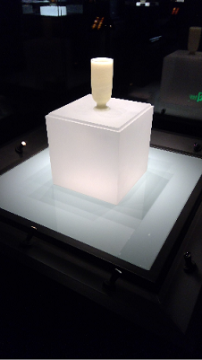
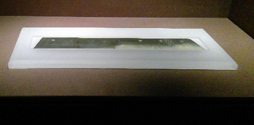
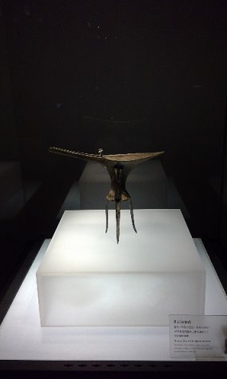
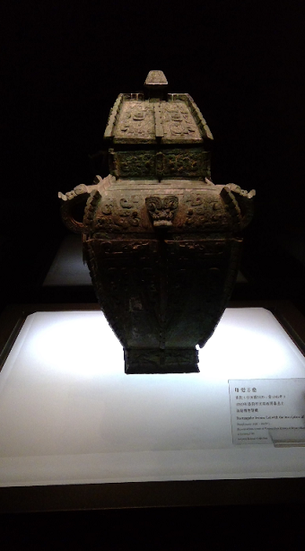
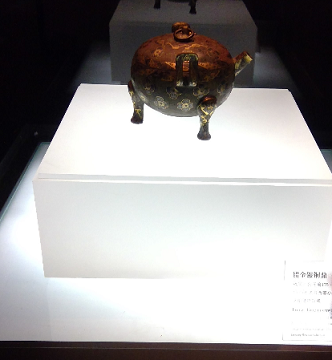
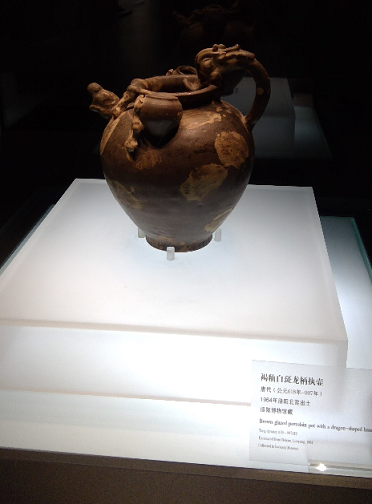
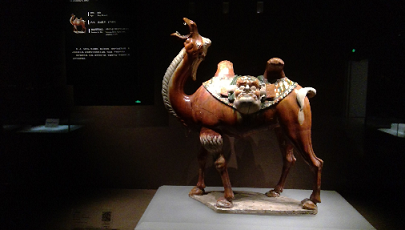
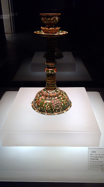

## 
 LuoYang Museum 
 ##

### 
 Zhengshi Stone Inscription 
 ###

### 
 White Jade Cup 
 ###

### 
 Jade Knife With Seven Holes 
 ###

### 
 Bronze he with nipple pattern 
 ###

### 
 Rectangular bronze Lei, with the inscription of MuGu 
 ###

### 
 Bronze Ding intertwined with gold and silver patterns 
 ###

### 
 Brown glazed porcelain pot with a dragon shaped handels 
 ###

### 
 Tri-color glazed pottery camel 
 ###

### 
 Tri-color pottery lamp 
 ###

## 
The End
 ##